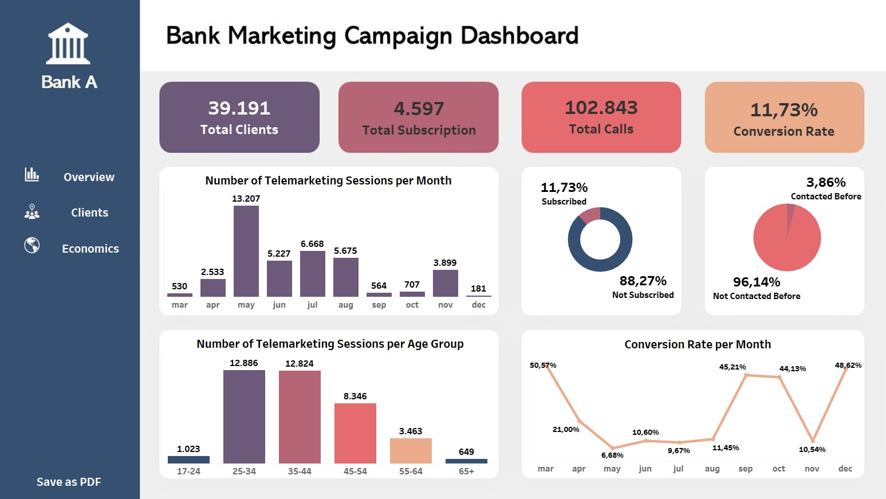
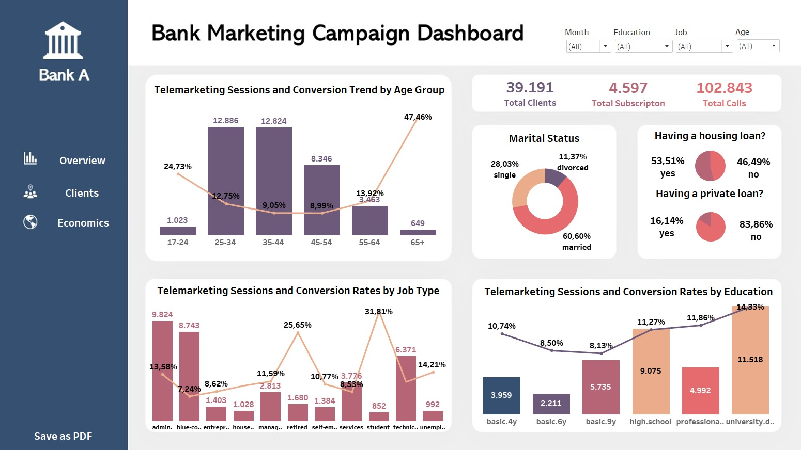
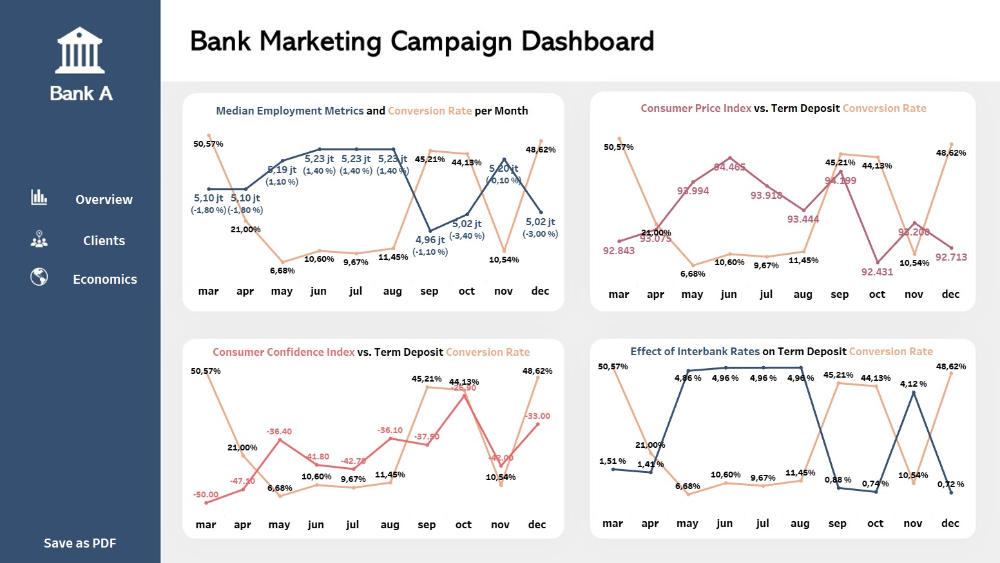
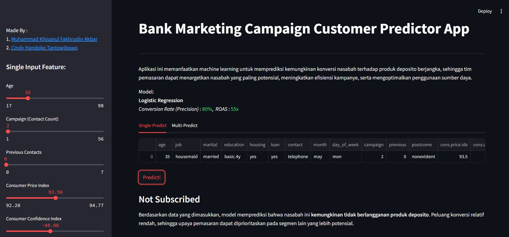
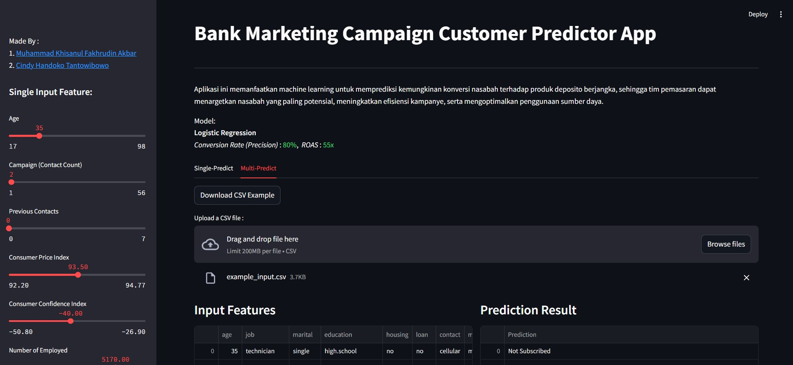

# Optimizing Term Deposit Telemarketing Campaigns Using Machine Learning to Improve Conversion Rates
---
<div align="center">

Disusun Oleh:  
<a href="https://www.linkedin.com/in/muhammad-khisanul-fakhrudin-akbar/">Muhammad Khisanul Fakhrudin Akbar</a> | <a href="https://www.linkedin.com/in/cindy-handoko-tantowibowo-55a2751a7/">Cindy Handoko Tantowibowo</a>

</div>


## 1. Business Understanding
Ketidaktepatan dalam menyasar target nasabah menjadi penyebab utama rendahnya efektivitas kampanye telemarketing Bank A. Banyak panggilan ditujukan kepada segmen yang tidak sesuai dengan karakteristik produk [deposito berjangka](https://archive.ics.uci.edu/dataset/222/bank+marketing), sehingga menghasilkan tingkat konversi yang sangat bervariasi. Pada periode tertentu, tingkat keberhasilan kampanye mencapai lebih dari 50%, namun di periode lainnya bisa turun drastis hingga di bawah 10%. Variasi ini mencerminkan bahwa strategi targeting yang digunakan belum optimal dan berdampak langsung pada tingginya biaya operasional pemasaran.

Menanggapi permasalahan tersebut, tim analisis data Bank A mengembangkan model prediktif berbasis machine learning. Model ini dibangun menggunakan data historis kampanye, mencakup atribut demografis, status keuangan, serta riwayat interaksi nasabah. Tujuannya adalah mengidentifikasi calon nasabah dengan potensi konversi lebih tinggi. Dengan pendekatan ini, tim marketing pada Bank A dapat menjalankan telemarketing secara lebih efisien, mengurangi pemborosan sumber daya, dan berpotensi meningkatkan rasio keberhasilan secara konsisten.

## 2. Goals
Meningkatkan efektivitas kampanye telemarketing produk deposito berjangka melalui penerapan model machine learning untuk mengidentifikasi nasabah dengan potensi konversi tinggi secara lebih tepat dan efisien. Target konversi ditetapkan sebesar 20–25% per bulan, melampaui rata-rata industri perbankan sebesar 14,47% [(sumber)](https://focus-digital.co/average-sales-call-conversion-rate-by-industry/), dan mulai diukur sejak bulan pertama implementasi. Sasaran ini dinilai realistis karena konversi historis pernah mencapai hingga 50%, dan pendekatan ini juga dirancang untuk mengatasi tantangan seperti rendahnya tingkat konversi, kurangnya segmentasi nasabah, serta perlunya alokasi sumber daya yang lebih efektif dan terarah.

## 3. Analytic Approach
* **Identifikasi Pola Nasabah**: Menganalisis data historis untuk menemukan karakteristik yang membedakan antara nasabah yang cenderung menerima atau menolak penawaran deposito.
* **Model Prediksi Klasifikasi**: Membangun model machine learning untuk secara akurat mengidentifikasi nasabah dengan kemungkinan tinggi melakukan konversi, guna meningkatkan efektivitas kampanye telemarketing.

## 4. Evaluation Metric
**Cost Evaluation :**
* Opportunity Cost  
    Bank berpotensi kehilangan sekitar US $350 per nasabah per tahun jika gagal menjangkau calon nasabah yang sebenarnya berminat terhadap produk deposito. Ini mencakup pendapatan dari bunga dan potensi bisnis lain yang hilang.
* Marketing Cost  
    Untuk menjangkau satu calon nasabah, bank mengeluarkan biaya sekitar US $5,02, mencakup panggilan telepon, infrastruktur CRM, dan gaji telemarketer. Biaya ini menjadi beban saat diarahkan ke nasabah yang tidak tertarik.


**Type Error:**  
* False Positive (Type I Error)  
    Model salah memprediksi nasabah akan tertarik padahal tidak. Akibatnya bank mengeluarkan biaya marketing (±$5,2/nasabah) tanpa hasil, menurunkan efisiensi dan laba kampanye.
* False Negative (Type II Error)   
    Model gagal mendeteksi nasabah yang sebenarnya tertarik. Akibatnya bank kehilangan potensi pendapatan (±$350/nasabah) dan peluang memperluas basis nasabah.

**Precision** adalah metrik utama dalam meningkatkan konversi kampanye karena menunjukkan seberapa akurat model dalam memprediksi nasabah yang benar-benar tertarik. Fokus pada precision membantu bank mengurangi biaya kontak yang sia-sia dan meningkatkan efisiensi pemasaran.

Dengan rumus:

$$
\text{Precision} = \frac{\text{True Positives}}{\text{True Positives} + \text{False Positives}}
$$

Semakin tinggi precision, semakin tepat sasaran strategi marketing, karena hanya nasabah potensial yang dihubungi. Ini menjadikan setiap interaksi lebih bernilai dan mendorong peningkatan tingkat konversi secara optimal.

## 5. Conclusions

1. **Profil Nasabah Tertentu Menunjukkan Potensi Konversi Lebih Tinggi**  
    Nasabah berusia 25–34 tahun, berpendidikan tinggi, tidak memiliki pinjaman pribadi, dan berstatus single merupakan segmen paling potensial. Selain itu, pensiunan dengan stabilitas finansial juga menunjukkan conversion rate yang tinggi meski jumlahnya kecil.

2. **Media komunikasi berpengaruh besar pada keberhasilan kampanye**
    Nasabah lebih responsif jika dihubungi lewat ponsel pribadi dibanding telepon rumah, karena sifatnya lebih personal dan relevan. Kontak melalui telepon rumah justru menurunkan respon positif sekitar 56%, sehingga channel ini kurang efektif untuk dijadikan pilihan utama.

3. **Riwayat kontak menentukan peluang konversi.**  
    Nasabah yang pernah dihubungi sebelumnya memiliki kemungkinan merespons positif sekitar tiga kali lebih besar dibandingkan yang belum pernah dihubungi. Mereka yang sebelumnya berhasil dikonversi juga berpeluang hampir dua kali lebih tinggi dibandingkan yang gagal, sementara nasabah yang belum pernah dihubungi menunjukkan potensi respons yang lebih baik daripada yang gagal sehingga layak menjadi target baru. Sebaliknya, nasabah dengan riwayat kegagalan konversi cenderung paling sulit untuk ditindaklanjuti.

4. **Kondisi Ekonomi Mempengaruhi Respons Nasabah terhadap Kampanye**  
    Ketika kondisi pasar tenaga kerja memburuk, misalnya pertumbuhan kerja negatif dan jumlah tenaga kerja menurun nasabah justru lebih tertarik pada deposito karena dianggap lebih aman. Sebaliknya, saat jumlah tenaga kerja meningkat, minat terhadap deposito cenderung menurun. Hal ini menunjukkan bahwa ketidakpastian ekonomi mendorong nasabah memilih produk keuangan yang lebih stabil seperti deposito.

5. **Model Machine Learning Mampu Meningkatkan Efisiensi Telemarketing**  
    Model logistic regression yang dikembangkan mampu meningkatkan conversion rate menjadi 80%, jauh melampaui rata-rata historis sebesar 26%. Ini menunjukkan bahwa pemanfaatan data historis dengan pendekatan prediktif dapat meningkatkan efektivitas secara konsisten.

## 6. Recommendations

1. **Fokuskan Target ke Profil Nasabah Potensial**
   Buat segmentasi kampanye berdasarkan karakteristik nasabah paling responsif, yaitu:

   * Usia 25–34 tahun
   * Pendidikan tinggi
   * Status single
   * Tidak memiliki pinjaman pribadi  
    Prioritaskan segmen ini dalam daftar panggilan untuk meningkatkan efisiensi dan peluang konversi.

2. **Optimalkan Channel Komunikasi yang Efektif**  
   Gunakan ponsel pribadi sebagai media utama untuk telemarketing karena terbukti lebih efektif dan personal. Kurangi penggunaan telepon kantor/rumah karena menurunkan peluang konversi secara signifikan.

3. **Kelola Riwayat Kontak untuk Strategi Follow-up**  
   Prioritaskan follow-up kepada nasabah yang pernah dihubungi pada periode sebelumnya, terutama yang sudah pernah berhasil dikonversi. Hindari terlalu banyak upaya pada nasabah dengan riwayat kegagalan berulang, karena efektivitasnya rendah.

4. **Optimalkan Pesan Kampanye Sesuai Tren Ekonomi untuk Tingkatkan Konversi**  
   Sesuaikan isi pesan kampanye dengan kondisi ekonomi terkini. Saat situasi ekonomi melemah, sorot manfaat keamanan, stabilitas, dan jaminan hasil dari produk deposito. Sebaliknya, ketika ekonomi mulai pulih, arahkan pesan pada peluang pertumbuhan dana dan fleksibilitas produk. Buat skrip telemarketing yang adaptif dan siapkan materi kampanye dinamis sesuai tren makroekonomi yang sedang berlangsung.

5. **Integrasikan Model Prediktif dalam Proses Telemarketing**  
   Gunakan model yang telah dibangun (logistic regression) untuk mengidentifikasi calon nasabah dengan probabilitas konversi tertinggi. Hal ini dapat meningkatkan efisiensi, mengurangi biaya, dan memperbesar peluang mencapai conversion rate di atas rata-rata historis.

## 7. Data Sources

Dataset [Bank Marketing Campaigns](https://www.kaggle.com/datasets/volodymyrgavrysh/bank-marketing-campaigns-dataset/data) berisi data kampanye telemarketing selama 10 bulan oleh sebuah bank di Portugal untuk mempromosikan produk deposito berjangka. Dataset ini mencakup 21 kolom dan merekam informasi nasabah, riwayat interaksi, serta indikator ekonomi makro.

Kolom-kolom terbagi dalam 5 kelompok:

1. **Informasi Klien (7 kolom)** – data demografis dan keuangan nasabah
2. **Detail Kontak (5 kolom)** – waktu dan metode komunikasi
3. **Riwayat Kampanye (4 kolom)** – frekuensi dan hasil kontak sebelumnya
4. **Indikator Ekonomi (4 kolom)** – data makro seperti suku bunga dan pengangguran
5. **Target (1 kolom)** – `y`, apakah nasabah menerima tawaran deposito

## 8. Project Structure

```
├── README.md         
|
├── data
│   ├── bank-additional-full.csv
|   |── bank_marketing_imptn.csv
|   |── example_input_stremlit.csv
│   └── bank_marketing_clean.csv
│
├── model          
│   ├── logreg_for_marketing_2.sav (80% Precision)
│   └── logreg_for_marketing.sav
│
├── notebook          
│   └──Bank_marketing.ipynb
│
├── reports            
│   └── Bank Marketing Campaign Dashboard.twbx
│
├── streamlit
|   |── function.py
│   └── main.py
│
└── requirements.txt 

```
## 9. Tableau Dashboard
Dashboard [Tableau Bank Marketing Campaign](https://public.tableau.com/app/profile/khisanul.fakhrudin/viz/BankMarketingCampaignDashboard_17525804810670/Overview) ini menyajikan visualisasi interaktif untuk menganalisis efektivitas kampanye telemarketing produk deposito. Dashboard mencakup profil nasabah, performa kampanye, dan insight konversi, yang membantu dalam memahami pola respon nasabah dan mengidentifikasi segmen dengan potensi konversi tertinggi.

* Overview Pages


* Clients Pages


* Economics Pages


## 10. Streamlit App Overview
[Aplikasi Bank Marketing Campaign Customer Predictor](https://finpro-bank-marketing.streamlit.app/) dikembangkan menggunakan Streamlit sebagai antarmuka interaktif untuk mendemonstrasikan hasil model machine learning dalam memprediksi minat nasabah terhadap produk deposito berjangka. Aplikasi ini memungkinkan pengguna untuk melakukan input data secara langsung melalui panel samping (*sidebar*) maupun melalui unggahan file CSV dalam jumlah banyak (*batch prediction*). Setelah data dimasukkan, aplikasi akan menampilkan hasil prediksi dalam bentuk yang mudah dipahami. 

* Streamlit Pages


* Contoh *batch prediction*


## 11. Installation
* Requirements: 
    * Python 3.13 atau lebih tinggi
    * Jupyter Notebook

* Installation:
```
git clone https://github.com/Meowstronot/Finpro_Streamlit
cd Finpro_Streamlit
pip install -r requirements.txt
```
* Run Analysis:
    * Pastikan library yang dibutuhkan sudah terinstall di environment
    * Buka file `Bank_marketing.ipynb` pada folder notebook

## 12. Contact

* Nama: Muhammad Khisanul Fakhrudin Akbar
* Email : shinaruikhisan@gmail.com
* Linkedin : https://www.linkedin.com/in/muhammad-khisanul-fakhrudin-akbar/

* Nama: Cindy Handoko Tantowibowo
* Email : cindyhtantowibowo@gmail.com
* Linkedin : https://www.linkedin.com/in/cindy-handoko-tantowibowo-55a2751a7/